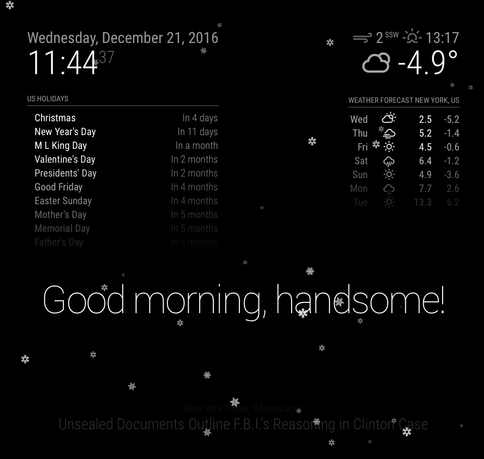

# Module: MMM-AntiScreenBurnIn
Based on MMM-Snow and Anti-Screen-Burn-In example from Strawberry 3.141



## Installation

In your terminal, go to your MagicMirror's Module folder:
````
cd ~/MagicMirror/modules
````

Clone this repository:
````
git clone https://github.com/ChicJr/MMM-AntiScreenBurnIn.git
````

Configure the module in your `config.js` file.

**Note:** After starting the Mirror, it will take a few seconds before the snow begins to fall ...

## Using the module

To use this module, add it to the modules array in the `config/config.js` file:
````javascript
modules: [
	{
		module: 'MMM-AntiScreenBurnIn',
		position: 'fullscreen_above',
		config: {
			// See 'Configuration options' for more information.
		}
	}
]
````

## Configuration options

The following property can be configured:


<table width="100%">
	<thead>
		<tr>
			<th>Option</th>
			<th width="100%">Description</th>
		</tr>
	<thead>
	<tbody>
		<tr>
			<td><code>flakeCount</code></td>
			<td>The number of snow flakes. More flakes are havier for the cpu, so don't go wild.
				<br><b>Default value:</b> <code>100</code>
			</td>
		</tr>
	</tbody>
</table>
